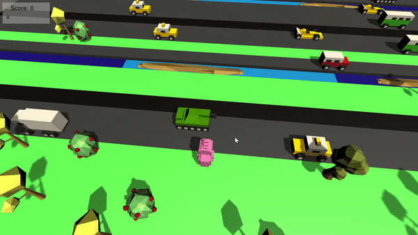

# CrossTheRoad  
CrossTheRoad is a game **inspired by the mobile game "Crossy Road"**.  
The game is about a player controlling the chicken to move forward to score points.  
This is my second attempt of mimicking mobile games to learn and publish Unity games.  

## Technology  
Language Used: **C#**  
Development Tool: **Unity**  

## Instructions  
Game on a website (Flash version) - click on a link [https://jieung.itch.io/crosstheseroads](https://jieung.itch.io/crosstheseroads)  
Game on a desktop (Application) - download both [CrossTheRoad.zip](CrossTheRoad.zip) and [CrossTheRoad2.zip](CrossTheRoad2.zip) files, unzip both files into a same folder and lanuch an executable file named **CrossTheseRoad**  
How to Play:
- Use WASD or Arrow keys to control the chicken  
- Player must avoid obstacles such as water, vehicles, and a train  
- Press Tab or click on restart button after death to play again  

## Demo  

